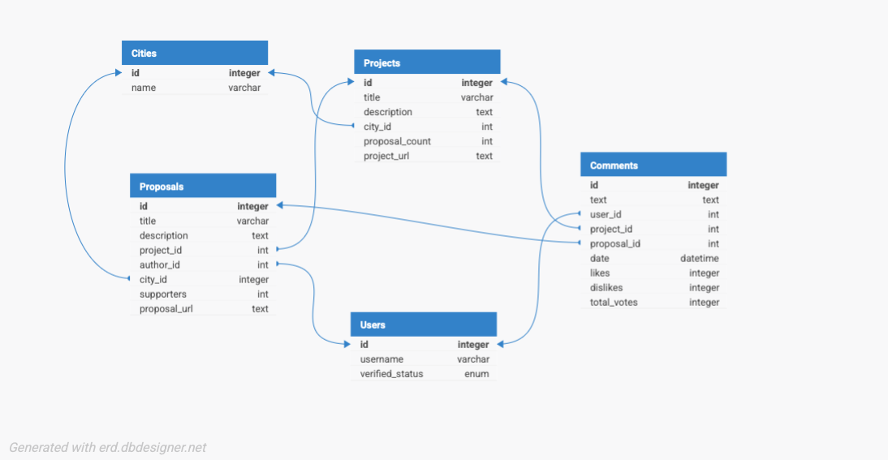

# ConsulDemocracy24 | Kommune Im Fokus

## Table of Contents
- [Introduction](#introduction)
- [ConsulAnalytics](#consulanalytics)
    - [About ConsulAnalytics](#about-consulanalytics)
    - [What We’ve Built](#what-weve-built)
    - [Why It Matters](#why-it-matters)
    - [Our Impact So Far](#our-impact-so-far)
    - [Open for Collaboration](#open-for-collaboration)
- [Scraping Notebook](#scraping-notebook)
- [Database Setup](#database-setup)
- [Project Structure](#project-structure)
- [Project Organization](#project-organization)
- [Technologies Used](#technologies-used)
- [Setup Instructions](#setup-instructions)
- [Usage](#usage)
    - [Web Application](#web-application)
- [Collaborators](#collaborators)

## Introduction
Citizen participation is a cornerstone of transparent and effective governance, yet many municipalities face challenges in achieving meaningful engagement. Barriers such as low accessibility to decision-making platforms, limited public awareness, and fragmented understanding of public sentiment hinder inclusive and data-driven decision-making.

The Consul Democracy platform offers a solution by enabling municipalities to involve citizens in city projects, budgeting, and planning. However, the platform's success relies on understanding how effectively it is being used and how engaged the citizens are.

This project addresses the problem by analyzing the platform’s content and usage patterns. It provides municipalities with actionable insights to improve project proposals, better involve residents, and understand public sentiment. Ultimately, this analysis benefits both governing bodies and citizens by fostering a more participatory and informed approach to civic decision-making.

## ConsulAnalytics

### About ConsulAnalytics
**Consul Analytics** is an **open-source analytics platform** designed to help municipalities **understand and enhance citizen engagement** on **Consul-powered** platforms.

Many cities use **Consul**, an open-source civic participation tool, to **gather proposals, discussions, and votes** from their residents. However, **municipalities struggle to extract meaningful insights** from this vast amount of data.

That’s where **Consul Analytics** comes in!

### What We’ve Built
✔ **Automated Data Scraper** – Collects real-time data from multiple Consul-based platforms used by different cities.  
✔ **User Behavior Insights** – Tracks engagement levels, discussion trends, and participation metrics across cities.  
✔ **Sentiment Analysis** – Analyzes public discussions to understand the mood of citizens on various topics.  
✔ **Trending Topics & Proposals** – Identifies the most discussed issues and successful proposals.  
✔ **Comparative Analysis** – Allows municipalities to compare citizen engagement across different cities.

### Why It Matters
Cities **thrive** when they **listen to their citizens**.  
**Consul Analytics** bridges the gap between **raw civic engagement data and actionable insights**, helping policymakers make **better, data-driven decisions**.

📢 **With Consul Analytics, municipalities can:**  
- Identify which topics matter most to citizens.  
- Understand how engagement evolves over time.  
- Compare citizen participation between different cities.  
- Improve transparency and accountability in governance.

### Our Impact So Far
✔ **Analyzed data from 18 cities in Germany**  
✔ **Processed over 50,000 user interactions**  
✔ **Provided municipalities with comprehensive user engagement reports**

### Open for Collaboration
As an **open-source project**, we invite **developers, researchers, and municipalities** to join us in expanding **Consul Analytics** and making civic engagement **more transparent, accessible, and impactful.**

🌍 **Let's build a smarter, more connected civic future together!** 🚀

## Scraping Notebook

### About Scraping.ipynb
The `Scraping.ipynb` notebook is designed to extract and organize data from multiple Consul-based platforms used by different cities. It collects data into three main DataFrames:

1. **`all_projects_df`**: Contains all projects from the websites.
   - Columns: `Project URL`, `Project Title`, `Project Description`, `Proposal Count`, `City`

2. **`all_proposals_df`**: Contains all proposals under projects.
   - Columns: `URL`, `Title`, `Proposed for Project`, `Description`, `Author`, `Comments`, `Supporters`, `City`

3. **`all_comments_df`**: Contains all comments under projects and proposals.
   - Columns: `URL`, `Project`, `Text`, `Author`, `Likes`, `Dislikes`, `Date`, `City`

### Key Functions
- **extract_proposals**: Extracts proposals from a project page.
- **extract_city_name**: Extracts the city name from the base URL.
- **scrape_project_page_with_proposals**: Scrapes the project page and extracts the project title, description, and proposals.
- **scrape_projects_with_proposals**: Scrapes the main projects page and extracts the project URLs.
- **scrape_all_comments**: Scrapes all comments from a paginated URL.

### Usage
To run the scraping notebook, follow these steps:

1. **Open the notebook:**
    ```bash
    jupyter notebook Scraping.ipynb
    ```

2. **Run all cells:**
    - This will execute the scraping functions and save the results to CSV files.

3. **Check the output:**
    - The scraped data will be saved in the `data/` directory as `all_projects.csv`, `all_proposals.csv`, and `all_comments.csv`.

## Database Setup

### About the Database
The database for the ConsulDemocracy24 project is designed to store and manage data related to city projects, proposals, and comments. It uses MySQL as the database management system and consists of several tables to organize the data efficiently.

### Database Structure
The database includes the following tables:
- **Cities**: Stores information about different cities.
- **Projects**: Stores information about city projects.
- **Users**: Stores information about users who participate in the platform.
- **Proposals**: Stores information about proposals submitted under projects.
- **Comments**: Stores comments made on projects and proposals.

### Database Schema
Below is a visual representation of the database schema:



### Setting Up the Database
To set up the database, follow these steps:

1. **Create the database and tables:**
    - Use the provided SQL script `create_database.sql` to create the database and tables.
    - Run the script in your MySQL database management tool.

2. **Input data into the database:**
    - Use the `input_data_to_db.py` script to input data from CSV files into the database.
    - Ensure you have the necessary CSV files (`all_projects.csv`, `all_proposals.csv`, `all_comments.csv`) in the `data/` directory.

## ConsulAnalytics Project Structure

- `app.py`: The main Flask application for the analytics platform.
- `data/`: Directory containing the CSV data files.
- `templates/`: Directory containing the HTML templates for the web pages.
- `static/`: Directory containing static assets like images and CSS files.

## ConsulAnalytics Project Organization

    ├── data                    <- Directory containing the CSV data files
    ├── templates               <- Directory containing the HTML templates for the web pages
    ├── static                  <- Directory containing static assets like images and CSS files
    ├── app.py                  <- Main Flask application
    ├── README.md               <- The top-level README for developers using this project.
    ├── requirements.txt        <- Python dependencies
    └── .gitignore              <- Git ignore file

## Technologies Used
- **React**: A JavaScript library for building user interfaces.
- **Express**: A web application framework for Node.js.
- **Axios**: A promise-based HTTP client for the browser and Node.js.
- **React Icons**: Include popular icons in your React projects easily.
- **Body-Parser**: Node.js body parsing middleware.
- **Node.js**: JavaScript runtime built on Chrome's V8 JavaScript engine.
- **Flask**: A micro web framework written in Python.
- **Pandas**: A data manipulation and analysis library for Python.
- **Matplotlib**: A plotting library for Python.
- **Seaborn**: A statistical data visualization library for Python.
- **WordCloud**: A library for generating word clouds in Python.

## Setup Instructions for ConsulAnalytics

1. **Navigate to the ConsulAnalytics directory:**
    ```bash
    cd ../ConsulAnalytics
    ```

2. **Create a virtual environment and activate it:**
    ```bash
    python -m venv venv
    source venv/bin/activate  # On Windows use `venv\Scripts\activate`
    ```

3. **Install the Python packages:**
    ```bash
    pip install -r requirements.txt
    ```

4. **Run the Flask application:**
    ```bash
    flask run
    ```

## Docker Setup Instructions

1. **Build the Docker image:**
    ```bash
    docker build -t consul-analytics .
    ```

2. **Run the Docker container:**
    ```bash
    docker run -p 8000:8000 consul-analytics
    ```

## Frontend Project Structure

- `src/App.js`: The main React component for the application.
- `src/server.js`: The Express server handling API requests.
- `public/`: Directory containing the public assets and HTML file.
- `src/`: Directory containing the React components and server code.

## Frontend Project Organization

    ├── public                  <- Directory containing the public assets and HTML file
    ├── src                     <- Directory containing the React components and server code
    │   ├── App.js              <- Main React component
    │   ├── server.js           <- Express server handling API requests
    ├── README.md               <- The top-level README for developers using this project.
    ├── package.json            <- Node.js dependencies and scripts
    └── .gitignore              <- Git ignore file

## Setup Instructions for Frontend Archive Project

1. **Clone the repository:**
    ```bash
    git clone https://github.com/denishotii/ConsulDemocracy24-kommueneImFokus.git
    ```

2. **Navigate to the frontend directory:**
    ```bash
    cd ConsulDemocracy24-kommueneImFokus/frontend
    ```

3. **Install the packages:**
    ```bash
    npm install
    ```

4. **Start the frontend application:**
    ```bash
    npm start
    ```

5. **Run the API server:**
    ```bash
    node src/server.js
    ```

## Conclusion

The analysis of the Consul Democracy platform provides valuable insights into how residents engage in decision-making processes for city projects, budgets, and planning. This analysis offers municipalities actionable data to improve their project proposals and foster greater citizen involvement in decision-making.

For the organization, this work sheds light on platform usage patterns across different cities, creating well-structured datasets and offering deeper insights into how cities leverage the Consul Democracy platform.

For citizens, the platform serves as a valuable resource to understand public opinion on specific projects and assess their own level of involvement in civic decisions. By enhancing transparency and inclusivity, this analysis contributes to building more participatory and effective governance.

## Collaborators

- [Denis Hoti](https://www.linkedin.com/in/denishoti/)
- [Veronika Rybak](https://www.linkedin.com/in/veronika-rybak-55379a337/)
- [Ali Guliyev](https://www.linkedin.com/in/ali-guliyev-389837238/)
- [Ruslan Tsibirov](https://www.linkedin.com/in/ruslan-tsibirov-6bb6a2262/)